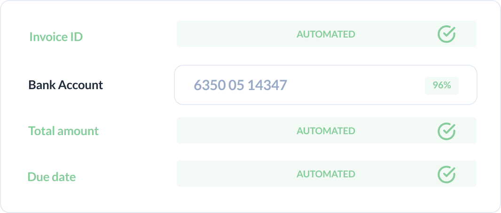

# How to deal with uncertain predictions

## End-to-end confidence

Every field that the model extracts has a corresponding confidence value. The confidence is different from a traditional OCR confidence in that it does not only estimate the probability that the characters are interpreted correctly, but also that it has extracted the correct information (e.g. the total amount and not the VAT amount).

# End-to-end confidence increases automation

## You can trust that the model is correct when it says so

When the confidence of a prediction is above a given threshold, the field can be hidden from the human validator.

This ensures that only fields that the API is uncertain about will be manually inspected, while the rest of the fields are fully automated. This means that users will save time and cost by not having to validate high-confidence predictions.

