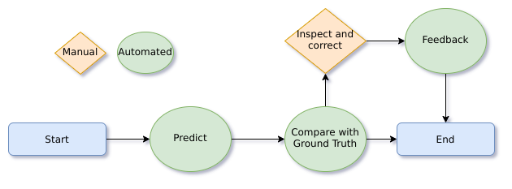

# Tutoral: Data cleaning - setup using LAS CLI 

In this tutorial you will learn how to setup a simple workflow that 
allows you to evaluate the models performance and at the same time 
clean up badly labeled data. 
Check out the complete folder with example values to get started 
[here](https://github.com/LucidtechAI/las-docs/tree/master/tutorials/data-cleaning/backend/src/).


The workflow in this tutorial will consist of four steps:
* automatic prediction
* automatic comparison of the existing ground truth with the prediction to filter out badly labeled data
* manual verification and correction of ground truth (this will only be performed when necessary)
* automatic feedback of the corrected ground truth back to the API


## Prerequisites
* Download the [lucidtech CLI](https://github.com/LucidtechAI/las-cli)
* Create a remote component by following [this tutorial](setup_approve_view.md) or just use 
[this standard remote component](https://github.com/LucidtechAI/las-docs/tree/master/tutorials/simple-demo/backend/src/Invoice/assets/jsRemoteComponent.js)


## Manual inspect and correct (manual transition)
To create a manual step you first need a remote component that will serve 
as a user interface. If you are using [this standard remote component](https://github.com/LucidtechAI/las-docs/tree/master/tutorials/simple-demo/backend/src/Invoice/assets/jsRemoteComponent.js)
you can also configure the fields to show and manipulate by adding an asset called `fieldConfig`. 
[Here](https://github.com/LucidtechAI/las-docs/tree/master/tutorials/simple-demo/backend/src/Invoice/assets/fieldConfig.json)
is an example of a field config for a typical invoice.


#### Create the remote component *asset*
When you have created your javascript remote component, 
lets call it `remote_component.js` you are ready to create an asset.
```commandline
$ las assets create remote_component.js
```
This should give the following output:
```commandline
{
  "assetId": "las:asset:<hex-uuid>",
  "name": null,
  "description": null
}
```
You now have an assetId that we will use to refer to this specific asset in the future. 
Note that you can also add a name and a description to help you identify the asset.


#### Create the *transition*
Create a json file, let's call it `params.json` with the following structure:
```json
{
  "assets": {
    "jsRemoteComponent": "las:asset:<hex-uuid>", 
    "fieldConfig": "las:asset:<hex-uuid>"
  }
}
```

`jsRemoteComponent` and `fieldConfig` are used to find the assets, 
so they have to be named like this if you want to use them.


Where `las:asset:<hex:uuid>` is replaced with the `assetId` you got in the previous step.
Now you are ready to create the manual step
```commandline
las transitions create manual -p params.json
```
This should give the following output
```commandline 
{
  "transitionId": "las:transition:<hex-uuid>",
  "name": null,
  "description": null,
  "transitionType": "manual",
  "inputJsonSchema": {
    "$schema": "https://json-schema.org/draft-04/schema#"
  },
  "outputJsonSchema": {
    "$schema": "https://json-schema.org/draft-04/schema#"
  },
  "parameters": {
    "assets": {
      "jsRemoteComponent": "las:asset:<hex-uuid>"    
    }
  }
}
``` 
As you can see from the output the transition can also accept name and description arguments, 
that is common for most resources in LAS.
In addition we recommend to provide input and output [json-schemas](https://json-schema.org/understanding-json-schema/) 
that can help you catch bad input immediately instead of triggering bugs at a later point in the workflow. 
Use `las transitions update --help` for more information on how to update your transitions.


## Automatic transitions (docker transitions)
An automatic step is made by creating a docker image that will perform a task without any user involved. 
Check our [sample images](https://github.com/LucidtechAI/las-docs/tree/master/docker-image-samples) and 
[tutorial](create_your_own_docker_transition.md)
for inspiration and best practices. 

The first step is to build a docker image and push it to some repository
```commandline
$ docker build . -t <image-url> && docker push <image-url>
```


*It is recommended to place the docker image in a private repository, 
if that is the case you need to store your credentials as a secret.*
```commandline
$ las secrets create  username=<username> password=<password> --description 'docker credentials'
```

The next step is to create a json-file that contains the parameters you need to run the docker image.

```json
{
  "imageUrl": "<image-url>",
  "secretId": "las:secret:<hex-uuid>"
}
```

The secretId field is only needed if you are using a private image.


Now we are ready to create the transition
```commandline 
las transitions create docker params.json
```

### Configuration of the *compare* transition

As you can see in main function of the 
[compare docker image](https://github.com/LucidtechAI/las-docs/tree/master/docker-image-samples/compare-prediction-and-ground-truth)
there are two environment variables that can be adjusted according to your needs. 
Check out [this](https://github.com/LucidtechAI/las-docs/tree/master/tutorials/data-cleaning/backend/src/Compare) 
folder to see an example of files that can be used to configure this transition.

#### CONFIDENCE_THRESHOLD
This variable sets the confidence limit that decides when to consider the predictions as relevant.
CONFIDENCE_THRESHOLD = 0.9 would mean that only those documents that were predicted with a confidence higher than 0.9 
AND were different from the ground truth will be subject for manual inspection. 
The default value is 0.0, which means that every prediction different from the ground truth will be subject for inspection.
    
#### GROUND_TRUTH_CONFIDENCE
If you want to inspect every sample manually you can set this value to less than 1.0. 

To adjust these variables you can use the CLI and update your transition:

```json
environment.json:
---
{
  "CONFIDENCE_THRESHOLD": "0.1",
  "GROUND_TRUTH_CONFIDENCE": "1.0"
}
```

```commandline
las transitions update las:transition:<hex-uuid> --environment-path environ.json
```


When you update the environment you need to specify all variables, not only those you want to change.



## Creating the workflow
Now that we have created the two transitions we are ready to put them 
together in a single workflow. The workflow definition must be provided using 
[Amazon States Language](https://docs.aws.amazon.com/step-functions/latest/dg/concepts-amazon-states-language.html).

The Resource name of each state must be a transition ID.


The only allowed *types* of States are **Task** and **Choice**.



```json
{
  "definition": {
    "Comment": "Data Cleaning Workflow",
    "StartAt": "MakePredictions",
    "States": {
      "MakePredictions": {
        "Type": "Task",
        "Resource": "las:transition:<hex>",
        "Next": "Compare"
      },
      "Compare": {
        "Type": "Task",
        "Resource": "las:transition:<hex>",
        "Next": "CorrectOrNot"
      },
      "CorrectOrNot": {
        "Type": "Choice",
        "Choices": [
          {
            "Variable": "$.needsCorrection",
            "BooleanEquals": true,
            "Next": "ManualCorrection"
          },
          {
            "Variable": "$.needsCorrection",
            "BooleanEquals": false,
            "End": true
          }
        ]
      },
      "ManualCorrection": {
        "Type": "Task",
        "Resource": "las:transition:<hex>",
        "Next": "Feedback"
      },
      "Feedback": {
        "Type": "Task",
        "Resource": "las:transition:<hex>",
        "End": true
      }
    }
  }
}
```

store the file and use it as input for creating the workflow
```commandline
$ las workflows create workflow.json --name 'Data Cleaning' 
```

###Execute workflow
You can now define your `input.json` and execute your workflow with a simple call from the CLI
```json
{
  "documentId": "las:document:<hex-uuid>",
  "modelId": "las:model:<hex-uuid>"
  "autoRotate": true,
}
```
```commandline
$ las workflows execute las:workflow:<hex-uuid> input.json 
```
You can also use [this](data-cleaning/start_execution.py) script for execution, 
or use or standard email-integration that will allow you to send in your documents by email. 
 

