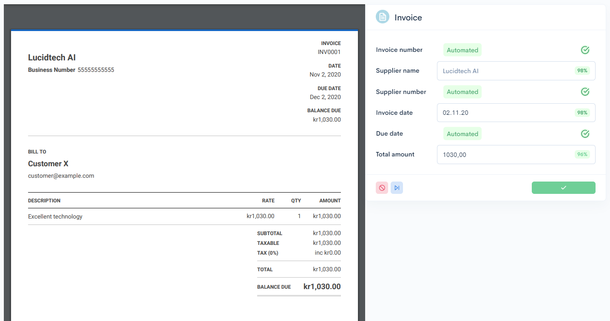

# Tutorial: Create a custom approval view in Flyt

With access to *Flyt*, you have the option to create your own React component to be loaded for each queue in its approval view.
The entire view is yours to do with as you see fit.

For now, we'll create a simple view with a PDF/image preview on half of the page, and a form
for the relevant document information on the other half. In addition, we'll include action buttons to either approve, skip, or reject a task.

## Build setup

Before we start creating the component, let's complete the build setup and everything that is necessary to get a working remote component built.

To have a functioning remote component, you need to create a `CommonJS` bundle because of the usage through [remote component](https://github.com/Paciolan/remote-component).
(TTNote: Link above is to github, consider if a link to gitbook is needed instead.)
You are free to use the bundler or build tool of your choice, but in this example, we'll make use of *Webpack*, as in in the examples in the above link.

### `src/index.js`

Create `src/index.js` and expose your component as the `default` export:

```javascript
import React from "react";

const RemoteComponent = () => {
  return <div>Hello Remote World!</div>;
};

export default RemoteComponent;
```

### `webpack.config.js`

The `libraryTarget` of the `RemoteComponent` must be set to `commonjs`.

Flyt already provides you with a React global (TTNote: Unclear if 'global' is the noun here or if a word is missing afterwards - such as 'React global variable' or 'React global library', etc), so it is highly recommended that you add it as an external library in your bundle.
If you are using React with hooks, you may see some unexpected behavior if you do not include this step, as there will be two different React runtimes.


```javascript
module.exports = {
  output: {
    libraryTarget: "commonjs"
  },
  externals: {
    react: "react"
  },
  ...yourConfigHere
};
```

Running a Webpack build will now create a `CommonJS` bundle file that can be loaded successfully. With the build setup done, we can start creating the components.

## Creating the component

### Props
The remote component will receive a few props we can utilize. For clarity, here are a few Typescript types from the API:

```ts
/** All props received from the Flyt app */
type RemoteComponentExternalProps = {
  /** Reject the current task */
  onReject: (taskError: string) => void;
  /** Approve the current task, providing the verified data */
  onApprove: (taskResult: Record<string, unknown>) => void;
  /** Skip the current task without explicitly rejecting/approving */
  onSkip: () => void;
  /** Ends the current session (navigates away to /processed). You do not need to use this. */
  onEndSession: () => void;
  /** Requests a new execution (task) from the current transition.
   * You most likely want to call this after rejecting/approving/skipping, in order to get a new execution */
  onRequestNew: () => void;
  /** Get an asset (e.g. a json file with some custom information you want to fetch) */
  getAsset: (assetId: string) => Promise<Asset>;
  /** The number of processed documents in the current "session" (browsing session without reloads) */
  numProcessed: number;
  /** The current Transition (queue) you are viewing */
  transition: Transition;
  /** Full task data (fields, predictions, etc.) */
  transitionExecution: TransitionExecution;
  /** What status the queue is in. Most relevant being "LOADING", "READY" in this case */
  queueStatus: QueueStatus;
  /** An instantiated SDK client in case you want to use anything from the SDK directly */
  client: Client;
};
```
Here is some extended type information for the above types:

```ts
enum QueueStatus {
  /** When a new task is loading after being requested from onRequestNew above */
  LOADING = 'LOADING',
  /** When the first task is being loaded after going into approve view */
  LOADING_FIRST_TASK = 'LOADING_FIRST_TASK',
  /** When the task is done loading */
  READY = 'READY',
  /** The remote component will be unmounted at this point, so these are not much use for you */
  EMPTY = 'EMPTY',
  TIMEOUT = 'TIMEOUT',
  REFRESH = 'REFRESH',
}

/** You probably don't care about much from this, except potentially the name and assets */
type Transition = {
  name: string;
  description: string;
  transitionId: string;
  transitionType: TransitionType;
  outputJsonSchema?: unknown;
  inputJsonSchema: unknown;
  assets?: Record<string, string>;
};

/** This will be the source of the data you will be working on */
type TransitionExecution = {
  executionId: string;
  transitionId: string;
  /** This is the input from the previous step in the workflow.
      The content will depend on the schemas defined in your workflow
    
      In a typical setup this might be something like:
      input: {
        documentId: 'las:document:abc',
        predictions: [
          {
            label: 'bank_account',
            value: '1010101',
            confidence: 0.9833426,
          },
        ],
      }
  */
  input: Record<any, any>;
  status: 'succeeded' | 'failed' | 'retry' | 'running' | 'rejected';
  completedBy: string | null;
  startTime: string | null;
  endTime: string | null;
};

```

### React code

Here's what we're making:



View [the source code here](https://github.com/LucidtechAI/las-docs/tree/master/tutorials/simple-demo/frontend/src/).
